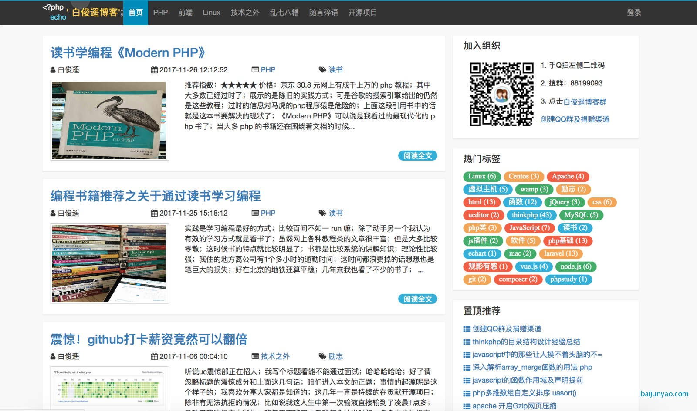

<h1 align="center">laravel-bjyblog</h1>
<p align="center">
    <a href="https://packagist.org/packages/baijunyao/laravel-bjyblog"></a>
    <a href="https://github.com/baijunyao/laravel-bjyblog/actions?query=branch%3Amaster"></a>
    <a href="https://codecov.io/gh/baijunyao/laravel-bjyblog/branch/master"></a>
    <a href="https://packagist.org/packages/baijunyao/laravel-bjyblog"></a>
    <a href="https://join.slack.com/t/baijunyao/shared_invite/enQtNjU3Nzk4Nzk4NjU3LWRhYmI4YmI3YjhjOTQyZGE2YTA3OTZjMjlhNGM4ZWQyNzNiOTMyYWI5YzAzYmE0ZDBhNmVjOWU1NTc4MWIxMzc"></a>
</p>

## Laravel PHP and MySQL Compatibility

| Blog      | Laravel | PHP         | MySQL |
|-----------|---------|-------------| --- |
| v17       | 9       | 8.0.2 - 8.1 | 5.6 - 8.0 |
| v15 - v16 | 8       | 8.0 - 8.1   | 5.6 - 8.0 |
| v14       | 8       | 7.3 - 7.4   | 5.6 - 8.0 |
| v7 - v13  | 7       | 7.2         | 5.6 - 8.0 |
| v6        | 6       | 7.2         | 5.6 - 8.0 |
| v5.8      | 5.8     | 7.1         | 5.6 - 8.0 |
| v5.5      | 5.5     | 7.0         | 5.6 - 8.0 |
| v1 - v5.3 | 5.3     | 5.6         | 5.6 - 8.0 |

## Preview



## Documentation

[English](https://baijunyao.com/docs/laravel-bjyblog/en) [中文文档](https://baijunyao.com/docs/laravel-bjyblog)  

## Testing

Run the tests with

```bash
./vendor/bin/phpunit
```

## Example

- [白俊遥博客](https://baijunyao.com)
- [larwas](https://www.larwas.com)
- [冯奎博客](https://fengkui.net)
- [林昙博客](http://blog.umaske.com)
- [记录你我](https://recwe.com)
- [咸鱼博客](http://www.tao3210.com)
- [LW放下的博客](http://www.putyy.com)
- [王如棋博客](http://wangruqi.top)
- [张子庭博客](https://www.loyating.com)
- [Victor·博客](http://victorblog.top)
- [上善若水](https://www.cassi.top)
- [史大坨博客](https://www.shidatuos.cn)

Welcome to submit a PR or tell me to include your blog

## Links

- Blog：[https://baijunyao.com](https://baijunyao.com)
- GitHub：[https://github.com/baijunyao/laravel-bjyblog](https://github.com/baijunyao/laravel-bjyblog)
- Gitee：[https://gitee.com/baijunyao/laravel-bjyblog](https://gitee.com/baijunyao/laravel-bjyblog)

## Contributors

Thanks goes to these wonderful people ([emoji key](https://allcontributors.org/docs/en/emoji-key)):

<!-- ALL-CONTRIBUTORS-LIST:START - Do not remove or modify this section -->
<!-- prettier-ignore-start -->
<!-- markdownlint-disable -->
<table>
  <tbody>
    <tr>
      <td align="center" valign="top" width="14.28%"><a href="https://www.hanjiaxin.com"><br /><sub><b>韩槑槑</b></sub></a><br /><a href="https://github.com/baijunyao/laravel-bjyblog/commits?author=Han-MeiM" title="Code">💻</a></td>
      <td align="center" valign="top" width="14.28%"><a href="https://github.com/khyoz"><br /><sub><b>k26</b></sub></a><br /><a href="https://github.com/baijunyao/laravel-bjyblog/commits?author=khyoz" title="Code">💻</a> <a href="#translation-khyoz" title="Translation">🌍</a></td>
      <td align="center" valign="top" width="14.28%"><a href="https://www.loyating.com"><br /><sub><b>loyating</b></sub></a><br /><a href="https://github.com/baijunyao/laravel-bjyblog/commits?author=loyating" title="Code">💻</a></td>
      <td align="center" valign="top" width="14.28%"><a href="https://github.com/lenkaren"><br /><sub><b>lenkaren</b></sub></a><br /><a href="https://github.com/baijunyao/laravel-bjyblog/commits?author=lenkaren" title="Code">💻</a></td>
      <td align="center" valign="top" width="14.28%"><a href="https://github.com/shukunwang"><br /><sub><b>Doraemon</b></sub></a><br /><a href="https://github.com/baijunyao/laravel-bjyblog/commits?author=shukunwang" title="Code">💻</a></td>
      <td align="center" valign="top" width="14.28%"><a href="http://xtty.ru"><br /><sub><b>Yuran</b></sub></a><br /><a href="https://github.com/baijunyao/laravel-bjyblog/issues?q=author%3Ayuri25" title="Bug reports">🐛</a> <a href="#translation-yuri25" title="Translation">🌍</a></td>
      <td align="center" valign="top" width="14.28%"><a href="https://baijunyao.com"><br /><sub><b>白俊遥</b></sub></a><br /><a href="https://github.com/baijunyao/laravel-bjyblog/commits?author=baijunyao" title="Code">💻</a> <a href="#translation-baijunyao" title="Translation">🌍</a> <a href="https://github.com/baijunyao/laravel-bjyblog/commits?author=baijunyao" title="Documentation">📖</a> <a href="https://github.com/baijunyao/laravel-bjyblog/commits?author=baijunyao" title="Tests">⚠️</a></td>
    </tr>
    <tr>
      <td align="center" valign="top" width="14.28%"><a href="http://tahsingokalp.com"><br /><sub><b>Tahsin Gökalp Şaan</b></sub></a><br /><a href="https://github.com/baijunyao/laravel-bjyblog/commits?author=TahsinGokalp" title="Code">💻</a></td>
      <td align="center" valign="top" width="14.28%"><a href="https://github.com/xyj2156"><br /><sub><b>阿杰</b></sub></a><br /><a href="https://github.com/baijunyao/laravel-bjyblog/commits?author=xyj2156" title="Code">💻</a></td>
      <td align="center" valign="top" width="14.28%"><a href="https://findcat.cn/"><br /><sub><b>梁桂锋</b></sub></a><br /><a href="https://github.com/baijunyao/laravel-bjyblog/commits?author=liangguifeng" title="Code">💻</a></td>
      <td align="center" valign="top" width="14.28%"><a href="https://github.com/KKKyle97"><br /><sub><b>KKKyle97</b></sub></a><br /><a href="https://github.com/baijunyao/laravel-bjyblog/commits?author=KKKyle97" title="Code">💻</a></td>
      <td align="center" valign="top" width="14.28%"><a href="https://github.com/xianhenyuan"><br /><sub><b>仙痕缘</b></sub></a><br /><a href="https://github.com/baijunyao/laravel-bjyblog/commits?author=xianhenyuan" title="Code">💻</a></td>
      <td align="center" valign="top" width="14.28%"><a href="https://github.com/huanghao9015"><br /><sub><b>黄浩</b></sub></a><br /><a href="https://github.com/baijunyao/laravel-bjyblog/commits?author=huanghao9015" title="Code">💻</a></td>
      <td align="center" valign="top" width="14.28%"><a href="https://github.com/HDVinnie"><br /><sub><b>HDVinnie</b></sub></a><br /><a href="#security-HDVinnie" title="Security">🛡️</a></td>
    </tr>
    <tr>
      <td align="center" valign="top" width="14.28%"><a href="https://github.com/hen8y"><br /><sub><b>Ogbonna Henry</b></sub></a><br /><a href="https://github.com/baijunyao/laravel-bjyblog/commits?author=hen8y" title="Code">💻</a></td>
    </tr>
  </tbody>
</table>

<!-- markdownlint-restore -->
<!-- prettier-ignore-end -->

<!-- ALL-CONTRIBUTORS-LIST:END -->

This project follows the [all-contributors](https://github.com/all-contributors/all-contributors) specification. Contributions of any kind welcome!

## License

laravel-bjyblog is open-sourced software licensed under the MIT license.

## Sponsors

[](https://www.jetbrains.com/phpstorm)
[](https://laravel-idea.com)
